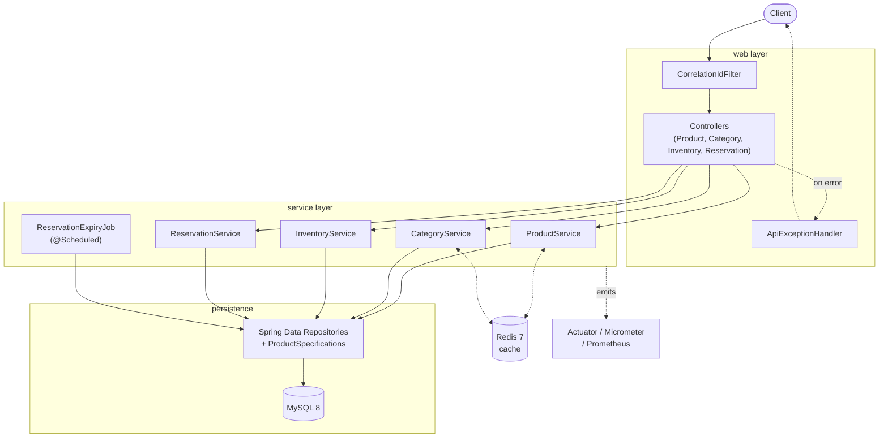
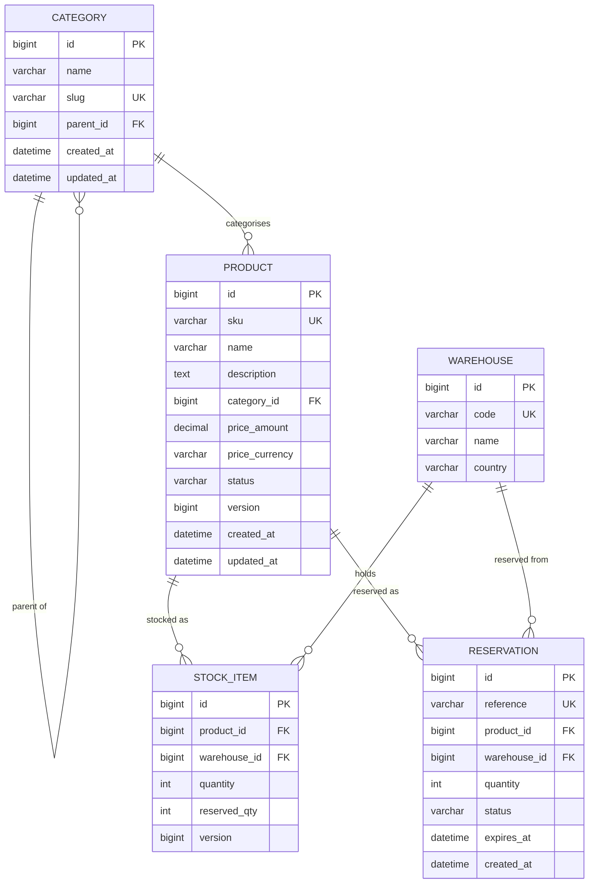
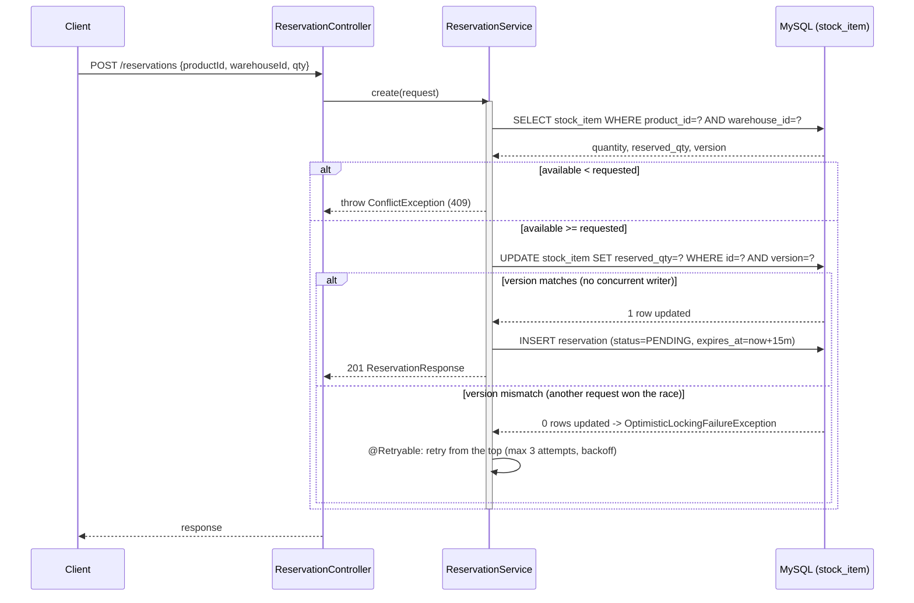

# ShopFlow Catalog & Inventory Service

A Spring Boot service that owns ShopFlow's product catalog, per-warehouse inventory, and short-lived stock reservations.


## Table of contents

- [Features](#features)
- [Tech stack](#tech-stack)
- [Architecture](#architecture)
- [Data model](#data-model)
- [Request flow](#request-flow)
- [Getting started](#getting-started)
- [Configuration](#configuration)
- [API](#api)
- [Design notes](#design-notes)
- [Concurrency: the reservation race](#concurrency-the-reservation-race)
- [Caching](#caching)
- [Observability](#observability)
- [Testing strategy](#testing-strategy)
- [Security](#security)
- [Project structure](#project-structure)
- [License](#license)

---

## Features

1. Full CRUD for categories and products, with validation and a single consistent error shape
2. Product search with paging, sorting, and multi-field filtering (text, category, status, price range)
3. Per-warehouse stock: adjust and transfer
4. Stock reservations (create / confirm / release) that provably never oversell stock
5. Redis read-through caching on hot read paths, with precise eviction on write and graceful degradation if Redis is unreachable
6. A scheduled background job that checks unconfirmed reservations and returns their stock automatically
7. Unit, slice, and integration tests with JaCoCo coverage floor (passing 80% line / 70% branch)
8. Actuator health/metrics/info, structured JSON logging with request correlation ids, and a custom Redis health check

## Tech stack

| Layer | Technology |
|---|---|
| Language / runtime | Java 21 |
| Framework | Spring Boot 4.1.1 |
| Build | Maven + wrapper |
| Database | MySQL 8 |
| Migrations | Flyway |
| Persistence | Spring Data JPA + Specifications |
| Cache | Redis 7 + Spring Cache |
| Mapping | MapStruct |
| Resilience | Spring Retry (optimistic-lock retries) |
| Metrics / health | Micrometer + Spring Boot Actuator + Prometheus |
| Logging | Logback + Logstash JSON encoder + MDC correlation ids |
| Docs | springdoc-openapi (Swagger UI) |
| Tests | JUnit 5, Mockito, AssertJ, Testcontainers |
| Coverage | JaCoCo |

## Architecture

Layered, one-way dependencies: `web` → `service` → `domain` / `repository`. JPA entities never leave the service layer — controllers only ever see DTOs. `@Transactional` lives on service methods only.

Category - Category: one category can have many child categories (self-referencing, via parent_id).

Category - Product: one category can have many products; each product belongs to exactly one category.

Product - StockItem: one product can have many stock records, one per warehouse it's stocked in.

Warehouse - StockItem: one warehouse can hold many stock records, one per product stocked there.

Product - Reservation: one product can have many reservations against it over time.

Warehouse - Reservation: one warehouse can have many reservations drawn from its stock.



## Data model



Key constraints (enforced at the database level, not just in application code): `reserved_qty <= quantity` and `quantity >= 0` on `stock_item`; `UNIQUE` on `product.sku`, `category.slug`, `warehouse.code`, `reservation.reference`. `Money` (`price_amount` + `price_currency`) is a JPA `@Embeddable`, not a separate table.

## Request flow

This is the reservation path, since it's the one with real invariants to protect (illustrates the optimistic-locking retry loop described in [Concurrency](#concurrency-the-reservation-race)):



## Getting started

### Prerequisites

Docker and Docker Compose. JDK 21 only if you want to run outside Docker.

### Run everything

```bash
git clone https://github.com/<user>/shopflow-catalog-service.git
cd shopflow-catalog-service
cp .env.example .env
docker compose up -d
./mvnw spring-boot:run -Dspring-boot.run.profiles=local
curl http://localhost:8080/actuator/health
```

Swagger UI: http://localhost:8080/swagger-ui.html

### Run the app locally against containerised dependencies

```bash
docker compose up -d mysql redis
./mvnw spring-boot:run -Dspring-boot.run.profiles=local
```

The `local` profile switches logging to plain, human-readable console output (`timestamp [thread] LEVEL [traceId] logger - message`) instead of the JSON format used everywhere else — see [Observability](#observability).

### Run the tests

```bash
./mvnw clean verify        # unit + slice + integration + coverage check
./mvnw test                 # fast tests only
open target/site/jacoco/index.html
```

## Configuration

| Variable | Default | Description |
|---|---|---|
| `DB_URL` | `jdbc:mysql://localhost:3306/shopflow` | JDBC URL |
| `DB_USERNAME` | `shopflow` | Database user |
| `DB_PASSWORD` | `shopflow` | Database password |
| `REDIS_HOST` | `localhost` | Redis host |
| `REDIS_PORT` | `6380` | Redis port (mapped off the default 6379 to avoid local port conflicts) |

| `application.yml` key | Default | Description |
|---|---|---|
| `cache.ttl.default-minutes` | `10` | TTL for `products` / `productBySku` cache entries |
| `cache.ttl.category-tree-hours` | `6` | TTL for the `categoryTree` cache entry (changes far less often) |
| `management.endpoints.web.exposure.include` | `health, info, metrics, prometheus` | Deliberately not '*' |
| `management.endpoint.health.show-details` | `when-authorized` | Anonymous callers get a bare `UP`/`DOWN`, not the full component breakdown |

## API

Base path `/api/v1`. Full contract with example payloads, request/response schemas, and every documented error response: Swagger UI (`/swagger-ui.html`) — every endpoint is annotated with `@Operation` and `@ApiResponses`, including its failure modes, not just the happy path.


- `POST /products/create` is for creating a new product, and the created product's id is returned in the response body.
- Product search is `POST /api/v1/products/search` with filters/sort/paging in the JSON body, rather than `GET`.

| Resource | Endpoints |
|---|---|
| Products | `POST /create`, `POST /search`, `GET /{id}`, `GET /sku/{sku}`, `PUT /{id}`, `PATCH /{id}/status`, `DELETE /{id}`, `GET /{id}/stock` |
| Categories | `POST /`, `GET /{id}`, `GET /`, `PUT /{id}`, `DELETE /{id}` |
| Inventory | `POST /adjust`, `POST /transfer` |
| Reservations | `POST /`, `GET /{ref}`, `POST /{ref}/confirm`, `POST /{ref}/release` |

## Design notes

**Sort/size safety.** Sort fields are checked against a fixed set before hitting the database (rejects unknown `sort=` values with `400 INVALID_SORT_FIELD`)
**Page size** is capped at 100 server-side regardless of what the client requests.

**The N+1 fix (M3).** Listing products with their category originally issued 1 query for the page + 1 count query + N queries (one per product's category), and it was confirmed by testing.

Then it was fixed with a `Specification`-based fetch join (`root.fetch("category", JoinType.LEFT)`, applied only to the data query via `query.getResultType() != Long.class`, so never the count query), then same request afterwards produces 2 queries total, independent of page size.

## Concurrency:

`ReservationService.create()` reads a `StockItem`, checks available stock, and writes an updated `reserved_qty`, so we have a real read-check-write gap where two simultaneous requests for the last unit could both pass the check before either writes back.

**Three approaches were on the table:**

| Approach | How it works | Trade-off |
|---|---|---|
| **Optimistic locking + bounded retry**| `using @Version` column; DB rejects a write if the row changed since it was read; `@Retryable` re-runs the whole method on collision( in the code we set the # if retries to 3)| (Chosen method) pays a retry cost only on real contention |
| **Pessimistic `@Lock(PESSIMISTIC_WRITE)`** | MySQL physically blocks other transactions from reading the row until the first commits | Guarantees correctness with zero retries, but *every* request will wait so extra cost  even when the waiting threads would never collide |
| **Conditional single-statement update** | Using a flag value to decide whether to update the row or no| Easiest, but it won't suit our case since we are handling many reservations for the SAME item so many Update statements are being executed on the same row(record)|

**Chosen: optimistic locking + retry.**
We chose optimistic locking with automatic retries over locking the database row on every single reservation attempt. This means normal operations stay fast, and only the rare case where two requests genuinely collide pays a small retry cost, instead of every request paying a locking cost just in case a collision happens. We proved this works correctly with an automated test that fires 20 simultaneous requests at 5 units of stock and confirms exactly 5 succeed, every time.


**Proof** `ProductIntegrationTest.reservation_concurrency_test` races 20 threads for 5 units of real stock (`ExecutorService` + `CountDownLatch` so all 20 start simultaneously): exactly 5 succeed, the rest receive `409`, and `stock_item.reserved_qty` never exceeds 5 in the real database. Verified both **with** and **without** `@Retryable` in place, to confirm the annotation is actually working, and removing it drops the observed success count, since a losing thread that exhausts its retries throws the framework's `OptimisticLockingFailureException` rather than the app's own `ConflictException`.

**Idempotency.** `confirm`/`release` both check the reservation's current status and calling either twice has the same effect as calling it once. Proven at both the unit level (mocked) and integration level (real database, calling each endpoint twice and asserting `quantity`/`reserved_qty` only move once).

**Expiry.** A `@Scheduled(fixedDelay = 60s)` job (`ReservationExpiryJob`) finds `PENDING` reservations past their `expires_at` in bounded batches (50 reservations at a time) and returns their stock. (The 15-minute hold duration and the 60-second sweep interval are independent numbers). Tested with a frozen, injected `Clock` rather than real waiting.

## Caching

**What's cached and why.** Product-by-id, product-by-SKU, and the category tree are cached. Stock and reservations are **never** cached because their whole purpose is to be correct at the instant of reading, and saving them in the cache increases the risk of overselling.

**Cache key design.** All keys prefixed with `shopflow:v1:`.
`products` and `productBySku` are separate caches (a product is reachable two ways); and we have `categoryTree` with longer TTL (6h vs the 10min default) since it changes far less often than a product.
Eviction on `update` targets the exact stale keys precisely (`key = "#id"` for the by-id cache, `key = "#result.sku()"` for the by-SKU cache which is evicted only after the method returns successfully, using the SKU already present on the response) since we ARE NOT able to update the sku value of any product.

**Null-value / negative-caching policy.** We are **not** caching misses (we used `disableCachingNullValues()`). I chose correctness over that specific DB-load optimisation especially that the risk we wanted to avoid is a customer creating a new product, then immediately looking it up, and getting a false "not found" because the cache had already remembered the old "doesn't exist" answer from before the product was created.

**Cache failure policy.** A `CacheErrorHandler` logs and swallows Redis get/put/evict/clear failures instead of propagating them and it was confirmed by stopping the Redis container and calling `GET /products/{id}`: the app still returns `200` from MySQL, with a `WARN` logged, not a `500`.

**Cache stampede.** we didn't build neither jittered TTL nor (no per-key lock). Why not: because at this project's current scale, this exact collision (hundreds of simultaneous requests for the same expiring key) essentially never happens).

## Observability

**Actuator endpoints exposed: `health`, `info`, `metrics`, `prometheus` and not `*`.** Other actuator endpoints (e.g. `env`) can leak configuration that shouldn't be public; explicitly listing only what's needed is a deliberate safety choice, not an oversight. Verified: neither `/actuator/health` nor `/actuator/info` exposes the database password, Redis credentials, or any connection string.

**Health.** `/actuator/health` reports MySQL and Redis automatically via Spring Boot's built-in indicators, plus a hand-written `RedisHealthIndicator` (`"customRedis"`) that does a real `PING` against Redis on every call.
Confirmed both up (`"status":"UP"`) and down (stopping the Redis container flips it to `"DOWN"` with the real error message attached) when the `show-details is set to always', but when `show-details: when-authorized` means the caller only sees a bare `UP`/`DOWN`, not the full per-component breakdown.

**Custom metrics.** `reservations.created` (counter) and `reservations.create.duration` (timer), both tagged by `outcome` (`success` / `insufficient_stock` / `error`) and of course never by anything with unbounded cardinality like `productId` or `reference`, which would create an unbounded number of permanent time series. Exposed via `/actuator/metrics/reservations.created`.

**Logging.** JSON-structured (Logstash encoder) in `!local`, controlled by `logback-spring.xml`'s `<springProfile>` blocks.

**Correlation ids.** `CorrelationIdFilter` generates a UUID per request (or reuses an incoming `X-Request-Id` header, for tracing across services), puts it in MDC for the lifetime of the request, and echoes it back as a response header. Every log line produced while handling that request carries the same id; it's also returned as `traceId` in `ApiError`, so a client-reported error can be traced directly to its exact log lines. The trace id is not present on background job logs (`ReservationExpiryJob`), since those aren't triggered by an HTTP request and never pass through the filter.

**Build metadata.** `/actuator/info` exposes the real artifact name, version, group, and build timestamp, generated automatically by the `spring-boot-maven-plugin`'s `build-info`.

## Testing strategy

Our test suite is split into three layers, each testing a different amount of the real system. Unit tests are the fastest and most used, they check one class's logic in isolation,
with every dependency faked, so no real database or network call ever happens. Unit tests load a small, real slice of Spring (just the web layer, or just the database layer) to check that a specific part actually wires together correctly.
Integration tests load the entire real application, against real MySQL and Redis containers, to prove the whole system genuinely works end to end, these are the fewest in number, since they're the slowest to run.

Clock and MeterRegistry are both passed into our services as constructor parameters rather than accessed as global/static values, which lets our tests supply a frozen, fake time instead of relying on real time passing.

./mvnw clean verify command was used to verify all tests passed.

## Project structure

```
src/main/java/com/shopflow/catalog/
  config/       JpaConfig (auditing), CacheConfig (Redis, error handling), CorrelationIdFilter, RedisHealthIndicator
  domain/
    model/      Category, Product, Warehouse, StockItem, Reservation, Money, ProductStatus, ReservationStatus
    exception/  NotFoundException, ConflictException, InvalidRequestException
  repository/   Spring Data repositories + ProductSpecifications (dynamic filtering, fetch-join)
  mapper/       MapStruct entity <-> DTO mappers
  service/      ProductService, CategoryService, InventoryService, ReservationService, ReservationExpiryJob
  web/          Controllers (with full OpenAPI annotations), ApiExceptionHandler
    dto/        Request/response records
src/main/resources/
  db/migration/       V1 baseline, V2 seed data, V3 search indexes
  application.yml
  logback-spring.xml  Profile-based plain-text vs JSON logging
src/test/java/com/shopflow/catalog/
  service/      Unit tests (Mockito) incl. ReservationExpiryJobTest
  web/          @WebMvcTest slice tests
  Repository/   @DataJpaTest slice tests (constraints, ProductSpecification)
  mapper/       Direct MapStruct-impl tests
  domain/model/ equals/hashCode tests
  support/      AbstractIntegrationTest (Testcontainers: MySQL + Redis)
    ProductIntegrationTest  incl. the 20-thread reservation concurrency test
```


